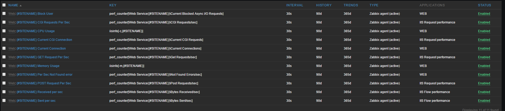
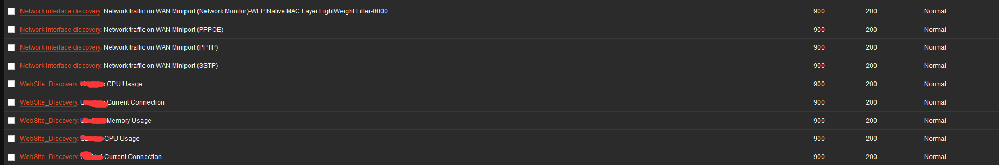
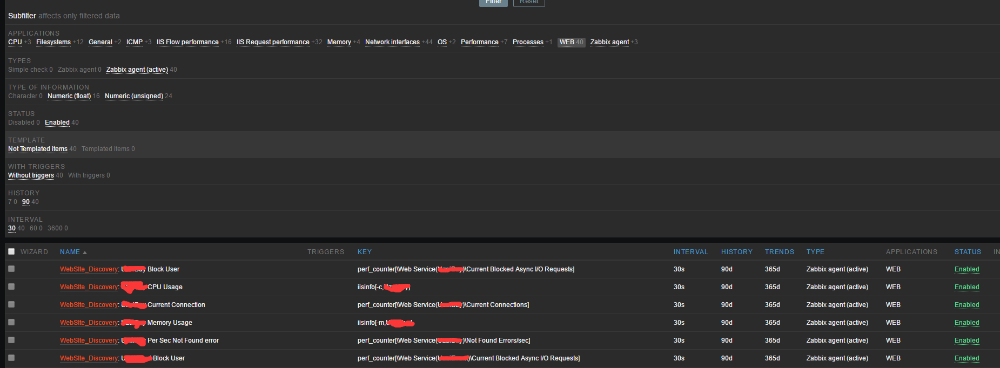

Zabbix-w3wp
====
自动发现IIS站点信息并监控，监控支持：CPU、内存、当前连接、每秒GET请求、每秒POST请求、当前站点打开的线程数等等（代码写得很简单勿喷）

如果觉得能帮助你们解决问题请点击右上角Star，谢谢

文件说明
----
w3wp.conf： ZabbixAgent需要增加的内容
getiissitename.exe： 获取IIS站点名称
getsiteinfo.exe：获取单个站点的CPU、内存等信息

使用说明
----
* 将w3wp.conf的内容增加到zabbix客户端的配置文件中
* 将script目录放置于zabbixAgent的安装目录下
* 重启Agent服务
* 在Web页面中导入w3wp.xml

提示
----
如果想要增加item那么根据如下操作:
模板---->Web---->Discovery---->item prototypes---->create item prototype---->自定义key
**所有的key都是通过Windows的性能监视器来获取的请自行查看性能监视器的配置（如有问题请发issue）**

图示
----

